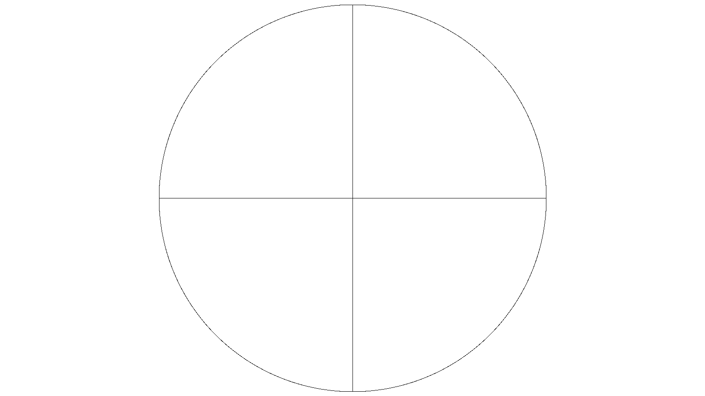

# i420toh264

* [Introduction](#introduction)
* [Building on Pi](#building-on-pi)
* [Execution on Pi](#execution-on-pi)
  * [Minimal use in pipeline](#minimal-use-in-pipeline)
  * [Simple non-modifying pipeline](#simple-non-modifying-pipeline)
  * [Simple modifying pipeline](#simple-modifying-pipeline)
  * [Medium modifying pipeline](#medium-modifying-pipeline)
  * [Advanced modifying pipeline](#advanced-modifying-pipeline)  
    * [Locating airplane](#locating-airplane)
    * [Alpha blending](#alpha-blending)  
 +  =   

## Introduction

Tool i420toh264 was built from [hello_pi/hello_encode](../hello_encode) with only few changes, see [diff for commit d4a5f005d91116fe1fa747c07ab1aeb75d5c732b](https://github.com/Hermann-SW2/userland/commit/d4a5f005d91116fe1fa747c07ab1aeb75d5c732b).  

It allows to convert [raspividyuv](https://www.raspberrypi.org/documentation/raspbian/applications/camera.md) video to .h264 encoded video.  
Reason for not using raspivid to create .h264 encoded video directly is, that in pipeline a "plugin" can process each and every YUV frame of the video stream easily, and either analyze+control and/or modify the frames, before final conversion to .h264.

All you need to know about [raspividyuv](https://www.raspberrypi.org/documentation/raspbian/applications/camera.md) frame [I420](https://fourcc.org/pixel-format/yuv-i420/) memory layout for processing:  
* each Y or U or V pixel value is stored as 1 byte  
* Y pixel values are followed by U and then V pixel values
* rows are stored from top to bottom  
* pixels in a row are stored from left to right  
* align_up(a,b) is minimal multiple of 2ᵇ which is ≥a  


## Building on Pi

To build i420toh264 on the pi, first build the libs:

    pushd /opt/vc/src/hello_pi
    make -C libs/ilclient
    make -C libs/vgfont
    popd

then in this directory, build i420toh264 and samples:

    make

## Execution on Pi

    $ ./i420toh264
    Usage: ./i420toh264 <filename> <width> <height>
    $
or

    ./i420toh264.bin

### Minimal use in pipeline

Record with raspividyuv on v2 camera, create tst.h264:

    raspividyuv -md 5 -w 1640 -h 922 -o - | ./i420toh264 tst.h264 1640 922

### Simple non-modifying pipeline

[sample_yuv_brightness.c](sample_yuv_brightness.c) receives yuv video frames from raspividyuv, and sends them unmodified to i420toh264 tool ([encode.c](encode.c)), which creates tst.h264. It analyzes the brightness of each frame by inspecting all frame pixels and outputs either "dark" or "bright". For example run below scene was dark, and light was turned on and off.  
Similar "plugin" can be used to detect airplane in the sky and control pan tilt camera system servos for always centered recording of the airplane.

    $ raspividyuv -md 5 -w 1640 -h 922 -o - -t 8000 -awb greyworld -fps 2 | \
    > ./sample_yuv_brightness 1640 922 | \
    > ./i420toh264 tst.h264 1640 922 > /dev/null
    bright
    bright
    dark
    dark
    dark
    bright
    bright
    dark
    dark
    bright
    $ 

### Simple modifying pipeline

[sample_yuv2grey.c](sample_yuv2grey.c) receives YUV video frames from raspividyuv, and sends them modified to i420toh264 tool ([encode.c](encode.c)), which creates tst.h264. It keeps Y value, but sets U and V values to 128 for all pixels, which is "to grey conversion" of input frame.  
Of course a modifying "plugin" can control eg. servos as well.

    $ time ( \
    > raspividyuv -md 5 -w 1640 -h 922 -o - -t 15000 -fps 25 | \
    > ./sample_yuv2grey 1640 922 | \
    > ./i420toh264 tst.h264 1640 922 > /dev/null \
    > )
    
    real	0m15.238s
    user	0m0.311s
    sys	0m13.464s
    $ 

### Medium modifying pipeline

[sample_yuv_dbl_roi.c](sample_yuv_dbl_roi.c) receives YUV video frames from raspividyuv, and sends them modified to i420toh264 tool ([encode.c](encode.c)), which creates tst.h264. Similar to raspivid[yuv] "-roi" option it extracts two regions of interest from input frame, and creates typically different format (2*w,d) frame as output for option "x1,y1,x2,y2,w,d". This can be useful especially for Stereo frames consisting of left and right camera frame in a single frame (like from [Arducam Stereo hat with two v1 cameras](https://www.uctronics.com/index.php/arducam-synchronized-stereo-camera-bundle-kit-5mp-for-raspberry-pi-2173.html) or two v2 cameras):

```
$ time (
> raspividyuv -md 7 -w 640 -h 480 -fps 90 -o - |
> ./sample_yuv_dbl_roi 640 480 40,160,371,51,240,180 |
> ./i420toh264 tst.h264 480 180
> )
Port 200: in 1/1 15360 16 disabled,not pop.,not cont. 160x64 160x64 @1966080 20
Port 200: in 1/1 15360 16 disabled,not pop.,not cont. 480x180 480x192 @1966080 20
OMX_SetParameter for video_encode:201...
Current Bitrate=1000000
encode to idle...
enabling port buffers for 200...
enabling port buffers for 201...
encode to executing...
looping for buffers...
Writing frame 1, len 0
0 0 0 1 27 64 0 14 ac 2b 40 f0 cf cf 0 f1 22 6a 0 0 0 1 28 ee 2 5c b0 
Writing frame 2, len 27
Writing frame 3, len 2658
...
Writing frame 448, len 4030
Writing frame 449, len 4136
Teardown.
disabling port buffers for 200 and 201...

real	0m5.266s
user	0m0.380s
sys	0m3.242s
$ 
```

This is 480x180 frame from generated video tst.h264:  


For comparison, this is full 640x480 frame:  


### Advanced modifying pipeline

#### Locating airplane

[sample_yuv_airplane.c](sample_yuv_airplane.c) receives YUV video frames from raspividyuv [or from elsewhere], and sends them modified to i420toh264 tool ([encode.c](encode.c)), which creates out.h264. It uses simple heuristic to locate an airplane in frame (determine its darkest pixel), and then marks that position with a 2x2 white marker. Later the determined position will be used to control the servos of a PT camera system for recording video always centered on airplane, without adding marker. Here you can see the command used to develop sample_yuv_airplane plugin offline, without raspividyuv and without i4202h264 (because that runs on Raspberry Pi only) on Ubuntu laptop:

```
$ ./sample_yuv_airplane 640 480 320 20 < <(bzip2 -dc day.yuv.bz2) >out.yuv 2>err
$ ffmpeg -video_size 640x480 -pixel_format yuv420p -i out.yuv out.h264 -y 2>err
$
```

Here you can see part of the generated video, overlayed with flow of operation:  


This is work in progress, but wanted to link here while not complete.  

This is stepper PT camera system used:  
"4 drops of superglue result in high precision PT camera system"  
[forum thread](https://forum.arduino.cc/index.php?topic=647703.0)  
  

This is automatic centering (at black ball, playing role of airplane) of video captured. 60fps framrate does not give enough time for stepper motor steps for higher speed, but should allow to follow airplane already (animation 4 times slower than real):  
[forum posting](https://www.raspberrypi.org/forums/viewtopic.php?f=43&t=252176&p=1568093#p1568093)  

 
#### Alpha blending

[sample_yuv_alpha.c](sample_yuv_alpha.c) receives YUV video frames from raspividyuv, and sends them modified to i420toh264 tool ([encode.c](encode.c)), which creates tst.h264. It keeps U and V values for all pixels, which is "keep color" of input frame. The Y values are modified according the same format (1640×922) alpha transparency .pgm file. This is first sample program that has to be compiled optimized (-O6) in order to work for 1640x922@25fps.

    $ time (
    > raspividyuv -md 5 -w 1640 -h 922 -o - -fps 25 | \
    > ./sample_yuv_alpha 1640 922 1640x922.circle900.pgm | \
    > ./i420toh264 tst.h264 1640 922 > /dev/null \
    > )
    
    real	0m5.359s
    user	0m2.792s
    sys	0m2.639s
    $ 

This is the flow:  


This is transparency example generated with [1640x922.circle900.c](1640x922.circle900.c) used in above command:  
(below images are scaled down to 25%, right click for full size)  
  

This is a frame from generated tst.h264 video:  
  

This is frame from scene without modifications, created with [Minimal in use pipeline](#minimal-use-in-pipeline):  


For easy visual verification of transparency "plugin" working:  


<a name="reticle"></a>Here is another transparency example generated with [1640x922.fine_crosshair_900.c](1640x922.fine_crosshair_900.c):  
  

This is a frame from generated tst.h264 video:  
  

